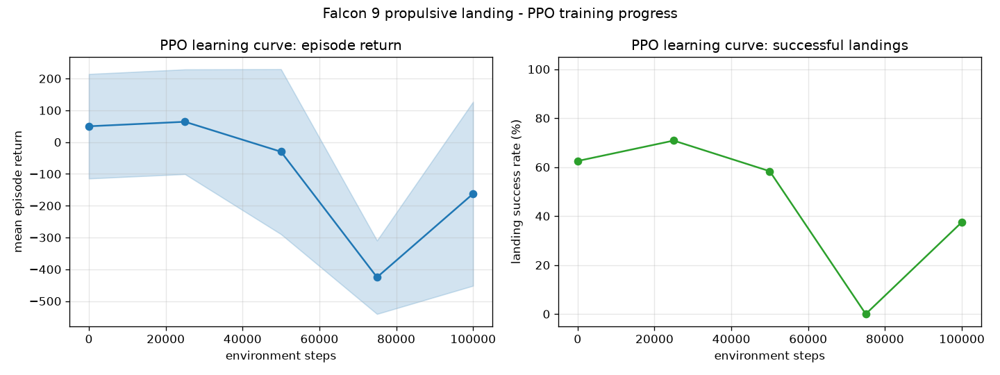

# Falcon 9 Landing - Reinforcement Learning

A Gymnasium environment where an agent learns to propulsively land a Falcon 9
first stage on the pad at `x = 0`, trained with PPO (Stable-Baselines3).

## The environment (`falcon9_landing/`)

Planar rigid-body model of the booster descending from ~1.4 km:

- **State (7):** `x, y, vx, vy, theta, omega, fuel`
- **Actions (2, continuous):** main-engine throttle `[0, 1]` and gimbal angle
  `[−7°, +7°]` (positive gimbal pitches the nose back toward −x)
- **Physics:** gravity, thrust along the gimballed body axis, quadratic aero
  drag with per-episode wind, propellant mass loss, gimbal torque about the
  center of mass plus passive grid-fin-style damping. 50 Hz, 30 s episodes.
- **Reward:** potential-based shaping toward a guided descent profile, a small
  fuel penalty, and terminal bonuses/penalties for touchdown quality. A
  landing counts if it's on the pad, under 10 m/s vertical, 6 m/s lateral,
  7° tilt and 0.25 rad/s tip rate.
- **Curriculum:** `set_difficulty(0..1)` interpolates the initial conditions
  from gentle low-altitude starts to the full task; the training script ramps
  it automatically.

## Training approach

Pure PPO from scratch reliably falls into a local optimum: it learns to hover
and burn out the clock (timing out beats crashing, but it never discovers the
landing bonus). So the pipeline is:

1. **`pd_controller.py`** — a hand-tuned PD controller (suicide-burn descent
   profile + lateral velocity-target steering) that lands ~30–60% of the time.
2. **`collect_demos.py`** — gathers successful PD episodes (demo states,
   actions, discounted returns).
3. **`bc_pretrain.py`** — behavioral-clones the demos into a fresh PPO policy
   with supervised learning (action head ← demo actions, value head ← demo
   returns).
4. **`train.py --init-model results/ppo_bc_init.zip`** — PPO finetuning from
   the cloned policy. With careful low-LR finetuning it improves on the
   demonstrator (62% → 71% successful landings at mid difficulty), though
   longer training is unstable: the hover local optimum reasserts itself
   (see Results).

```bash
python3 -m venv .venv
.venv/bin/pip install torch --index-url https://download.pytorch.org/whl/cpu
.venv/bin/pip install -r requirements.txt

.venv/bin/python collect_demos.py          # -> results/demos.npz
.venv/bin/python bc_pretrain.py            # -> results/ppo_bc_init.zip
.venv/bin/python train.py --init-model results/ppo_bc_init.zip  # PPO finetune
.venv/bin/python evaluate.py               # scores every checkpoint -> results/eval.json
.venv/bin/python plot_results.py           # learning curves -> results/learning_curve.png
.venv/bin/python render_videos.py          # side-by-side video -> results/landing_comparison.mp4
```

## Results



`results/landing_comparison.mp4` shows the BC warm-start policy next to the
PPO-finetuned policy flying the same task side by side.

Measured on 24 fixed-seed episodes at mid difficulty (`set_difficulty(0.5)`):

| policy | success rate | mean return |
|---|---|---|
| PPO from scratch | 0% (hover/timeout local optimum) | ≈ −220 |
| PD controller (demonstrator) | ~30–60% | — |
| BC warm start (`ppo_bc_init`) | 62.5% | +50 |
| PPO finetuned, 25k steps | **70.8%** | +64 |

Notes and honest limitations:

- Pure PPO from scratch reliably falls into the hover local optimum: timing
  out (−120) beats crashing, so it learns to burn out the clock and never
  discovers the landing bonus.
- The environment fights this with a −400 timeout penalty, a continuous
  anti-loitering penalty (descending slower than the guided profile costs
  every step — a terminal penalty alone is invisible to γ=0.99 over 1500
  steps), and graduated terminal rewards for near-pad touchdowns.
- Even so, PPO finetuning past ~25–50k steps at lr=3e-5 destabilizes and
  collapses back into hovering (0% at 75k steps in this run). Early stopping
  on a fixed-seed eval set is required.
- Full difficulty (`set_difficulty(1.0)`) remains unsolved: the mid-difficulty
  policy manages only ~17% there, mostly hovering. The demo PD controller
  itself lands only ~13% at full difficulty, so better demonstrations (or a
  different algorithm) are needed for the full task.

## Files

| file | what |
|---|---|
| `falcon9_landing/env.py` | the `Falcon9Landing-v0` environment |
| `pd_controller.py` | hand-tuned PD controller (demo generation) |
| `collect_demos.py` | collects successful PD episodes |
| `bc_pretrain.py` | behavioral cloning into a PPO policy |
| `train.py` | PPO training (from scratch or `--init-model`) with curriculum + checkpoints |
| `evaluate.py` | mean return + success rate per checkpoint, saves trajectories |
| `plot_results.py` | learning-curve plots |
| `render_videos.py` | matplotlib animation of landing trajectories |
| `results/` | demos, checkpoints, `eval.json`, plots, video (generated) |
